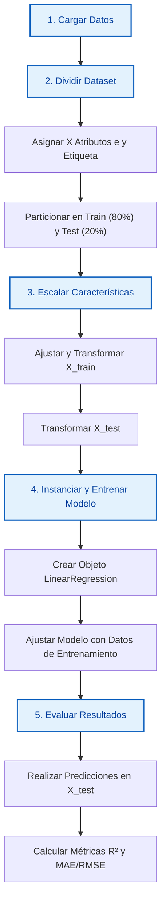

# 📘 Guía Completa de Regresión Lineal para Machine Learning

La **regresión lineal** es un algoritmo de aprendizaje supervisado utilizado para predecir un valor numérico continuo (la etiqueta o `target`) a partir de una o más variables de entrada (atributos o `features`).

## 1. La Ecuación Matemática

En Machine Learning o Aprendizaje Automático, la clásica ecuación de la línea recta ($y = mx + b$) se generaliza para poder escalar a múltiples variables de entrada.

## Regresión Lineal Simple (Una sola variable)

$$\hat{y} = w_1x_1 + b$$

## Regresión Lineal Múltiple (Dos o más variables)

$$\hat{y} = w_1x_1 + w_2x_2 + \dots + w_nx_n + b$$

## Significado de cada componente:

* **$\hat{y}$ (Predicción):** Es el valor estimado que calcula el modelo (por ejemplo, el precio de una casa).
* **$x_1, x_2, \dots, x_n$ (Atributos / Features):** Las variables independientes de entrada (por ejemplo, tamaño en m², número de habitaciones).
* **$w_1, w_2, \dots, w_n$ (Pesos / Weights / Parámetros):** Representan la pendiente o importancia de cada variable. Indican cuánto cambia $\hat{y}$ por cada unidad que incrementa esa variable de entrada.
* **$b$ (Sesgo / Bias / Intercepto):** Es el punto donde la línea corta el eje $Y$. Representa el valor estimado de $\hat{y}$ cuando todas las variables de entrada ($x$) son iguales a cero.


## 2. ¿Cómo Aprende el Modelo? (Función de Pérdida)

El objetivo del entrenamiento es encontrar los valores de los pesos ($w$) y el sesgo ($b$) que minimicen los errores de predicción. Para medir este error se utiliza la **Función de Pérdida** llamada **Error Cuadrático Medio (MSE):**

$$MSE = \frac{1}{m} \sum_{i=1}^{m} (y_i - \hat{y}_i)^2$$

* **$m$:** Número total de ejemplos en el dataset.
* **$y_i$:** Valor real de la muestra.
* **$\hat{y}_i$:** Valor predicho por el modelo.

El algoritmo eleva los errores al cuadrado por dos razones principales: **elimina los signos negativos** (para que los errores no se cancelen entre sí) y **penaliza con mayor severidad los errores grandes**.

## Métodos de Optimización

Para encontrar el mínimo del MSE, existen dos caminos principales:

1. **Ecuación Normal:** Una fórmula algebraica directa que calcula analíticamente los parámetros óptimos. Es ideal para datasets pequeños.
2. **Gradiente Descendiente:** Un algoritmo iterativo que da "pequeños pasos" hacia la dirección donde el error disminuye más rápido. Es el método estándar para datasets masivos en Big Data y Deep Learning.

## 3. Supuestos Críticos de la Regresión Lineal

Para que un modelo de regresión lineal sea confiable y preciso, tus datos deberían cumplir con cinco condiciones fundamentales:

* **Linealidad:** La relación entre las variables independientes y la variable dependiente debe ser lineal.
* **Independencia (No Autocorrelación):** Los residuos (errores) de cada predicción deben ser independientes entre sí. Esto es crucial en series temporales.
* **Homocedasticidad:** La varianza de los errores debe ser constante a lo largo de todas las predicciones. Si el error aumenta a medida que aumentan los valores, el modelo pierde precisión.
* **Normalidad de los residuos:** Si graficas los errores, estos deben distribuir de forma similar a una campana de Gauss (distribución normal).
* **Ausencia de Multicolinealidad:** Las variables de entrada no deben estar altamente correlacionadas entre sí (por ejemplo, incluir "metros cuadrados" y "pies cuadrados" confundirá los pesos del modelo).

## 4. Métricas de Evaluación

Para saber si tu modelo es bueno o malo, debes medirlo con datos de prueba utilizando estas tres métricas estándar:

| Métrica | Nombre | ¿Qué mide? | Escala / Interpretación |
|---|---|---|---|
| **MAE** | Error Absoluto Medio | El promedio de los errores en las mismas unidades de la variable original. | Menor es mejor. Muy intuitivo. |
| **MSE** | Error Cuadrático Medio | El promedio de los errores al cuadrado. | Menor es mejor. Sensible a valores atípicos (outliers). |
| **RMSE** | Raíz del Error Cuadrático Medio | La raíz cuadrada del MSE, lo que devuelve el error a la escala original. | Menor es mejor. Es la métrica más utilizada en competencias. |
| **$R^2$** | Coeficiente de Determinación | El porcentaje de la variabilidad de los datos que el modelo logra explicar. | Va de 0 a 1. **1.0** es un ajuste perfecto. |

## 5. Regularización (Evitar el Overfitting)

Cuando un modelo de regresión lineal múltiple tiene demasiadas variables o pesos muy grandes, tiende a memorizar los datos de entrenamiento (**Overfitting** o sobreajuste). Para solucionarlo se añade una penalización a la función de pérdida:

* **Regresión Ridge (L2):** Añade una penalización proporcional al cuadrado de los valores de los pesos ($w^2$). Contrae los pesos cerca de cero, pero nunca los elimina por completo. Es excelente si todas las variables aportan valor.
* **Regresión Lasso (L1):** Añade una penalización proporcional al valor absoluto de los pesos ($\vert{}w\vert{}$). Tiene la propiedad de forzar a que los pesos de las variables irrelevantes sean exactamente **cero**, sirviendo automáticamente como un método de selección de variables.
* **ElasticNet:** Combina de forma equilibrada las penalizaciones de L1 (Lasso) y L2 (Ridge).

## 6. Librerías esenciales

* **NumPy:** Permite manejar los arreglos de datos numéricos.
* **Pandas:** Ayuda a cargar y limpiar las bases de datos en formato tabular.
* **Matplotlib y Seaborn:** Sirven para graficar los datos y la línea de tendencia.

## 7. Flujo de Trabajo en Python (Pipeline Estándar)

A nivel de código, implementar una regresión lineal sigue un estándar estricto en la industria:

1. Cargar datos
2. Dividir el dataset (Entrenamiento y Prueba)
3. Escalar características (Muy recomendado para Regresión Lineal)
4. Instanciar y Entrenar el Modelo
5. Evaluar Resultados

## 8. Diagrama de Flujo del Pipeline Estandar



### Detalle de los Pasos del Flujo de Trabajo

#### 1. Cargar datos

* **¿En qué consiste?** Consiste en importar la información desde fuentes externas (archivos CSV, bases de datos SQL, archivos Excel, etc.) a la memoria activa de tu programa utilizando estructuras de datos eficientes.
* **Herramienta clave:** `pandas.read_csv()` o funciones similares de la librería Pandas.
* **Por qué importa:** En este paso inicial debes asegurarte de identificar y separar la variable dependiente (la etiqueta o $y$ que deseas predecir) de las variables independientes (los atributos o $X$ que usarás para predecir).

#### 2. Dividir el dataset (Entrenamiento y Prueba)

* **¿En qué consiste?** El dataset total se fragmenta aleatoriamente en dos subconjuntos independientes: **Entrenamiento** (usualmente el 70%-80% de los datos) y **Prueba** (el 20%-30% restante).
* **Herramienta clave:** `train_test_split()` del módulo `sklearn.model_selection`.
* **Por qué importa:** Evita el autoengaño del modelo. Al separar un conjunto de prueba que el algoritmo jamás verá durante el entrenamiento, garantizas tener datos limpios para simular cómo se comportará el modelo en el mundo real frente a nuevos clientes o mediciones.

#### 3. Escalar características

* **¿En qué consiste?** Transforma los valores numéricos de tus atributos para que todos compartan una misma escala matemática (por ejemplo, con una media de 0 y una varianza de 1), sin alterar la distribución original de los datos.
* **Herramienta clave:** `StandardScaler()` o `MinMaxScaler()` de `sklearn.preprocessing`.
* **Regla de oro:** Se utiliza `.fit_transform()` exclusivamente en el conjunto de entrenamiento (`X_train`) y únicamente `.transform()` en el conjunto de prueba (`X_test`). Esto previene la "filtración de datos" (_data leakage_).
* **Por qué importa:** Si un atributo mide el peso en libras (rango de 2000 a 5000) y otro mide el número de puertas (rango de 2 a 5), la regresión lineal podría darle prioridad matemática errónea al peso debido a la magnitud de sus números, en lugar de a su verdadera importancia predictiva.

#### 4. Instanciar y Entrenar el Modelo

* **¿En qué consiste?** Se crea el objeto del algoritmo en la memoria del script (instanciación) y posteriormente se le proveen los datos de entrenamiento para que ejecute sus fórmulas internas (entrenamiento).
* **Herramienta clave:** `LinearRegression()` y su método `.fit(X_train_scaled, y_train)` de `sklearn.linear_model`.
* **Por qué importa:** Durante el `.fit()`, el algoritmo ejecuta el método de mínimos cuadrados o gradiente descendiente. Es aquí donde la computadora calcula los valores óptimos para los pesos ($w$) y el sesgo ($b$) que minimizan el error cuadrático.

#### 5. Evaluar Resultados

* **¿En qué consiste?** Se alimenta al modelo entrenado con los atributos escalados de prueba (`X_test_scaled`) para generar predicciones sintéticas. Luego, estas predicciones se comparan matemáticamente contra las etiquetas reales (`y_test`).
* **Herramienta clave:** Métodos como `.predict()`, junto con funciones métricas como `r2_score()` y `mean_absolute_error()`.
* **Por qué importa:** Te permite obtener las métricas de rendimiento definitivas. Si el coeficiente de determinación ($R^2$) es alto y cercano a 1, sabrás que tu pipeline es sólido y que el modelo está listo para producción.


**Ejemplo:**

```python
import pandas as pd
from sklearn.model_selection import train_test_split
from sklearn.preprocessing import StandardScaler
from sklearn.linear_model import LinearRegression
from sklearn.metrics import mean_absolute_error, r2_score

# 1. Cargar datos
df = pd.read_csv("datos.csv")
X = df[['Variable1', 'Variable2']]
y = df['Target']

# 2. Dividir el dataset (Entrenamiento y Prueba)
X_train, X_test, y_train, y_test = train_test_split(X, y, test_size=0.2, random_state=42)

# 3. Escalar características (Muy recomendado para Regresión Lineal)
scaler = StandardScaler()
X_train_scaled = scaler.fit_transform(X_train)
X_test_scaled = scaler.transform(X_test)

# 4. Instanciar y Entrenar el Modelo
modelo = LinearRegression()
modelo.fit(X_train_scaled, y_train)

# 5. Evaluar Resultados
predicciones = modelo.predict(X_test_scaled)
print(f"R² Score: {r2_score(y_test, predicciones):.2f}")
print(f"MAE: {mean_absolute_error(y_test, predicciones):.2f}")
```