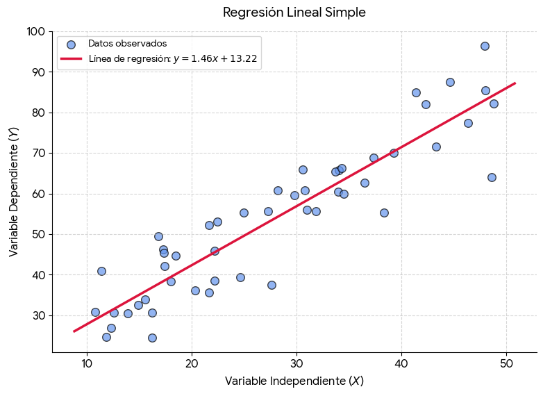
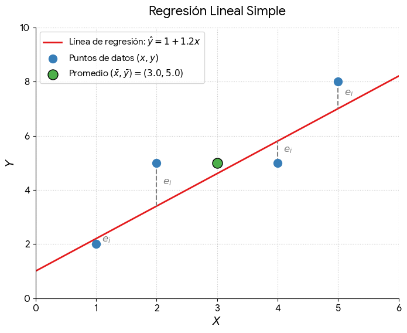
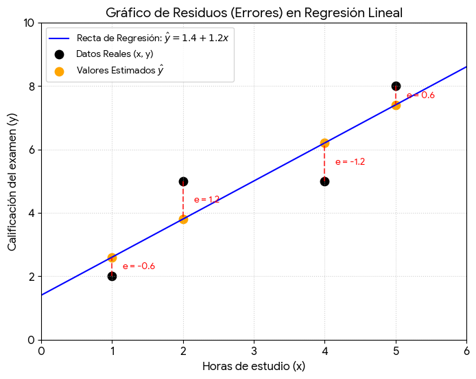

La **regresión lineal** es un método estadístico que modela la relación entre una variable dependiente ($Y$) y una o más variables independientes ($X$) mediante una línea recta. Su objetivo principal es encontrar la ecuación de la recta que mejor se ajuste a los datos para predecir valores futuros o entender el impacto de las variables.

> Gráfico generado usando Python, numpy y matplotlib (líbrerias)

## Tipos de regresión lineal
 
* **Regresión lineal simple:** Usa una **sola variable independiente** para predecir la variable dependiente.

    > Su fórmula básica es $Y = \beta_0 + \beta_1X + \epsilon$.

* **Regresión lineal múltiple:** Utiliza **dos o más variables independientes** para predecir el resultado.

    > Su fórmula se extiende a $Y = \beta_0 + \beta_1X_1 + \beta_2X_2 + ... + \beta_nX_n + \epsilon$.

## Casos en que se aplica
Se aplica cuando existe una **_relación continua_** y **_lineal_** entre las variables. Algunos ejemplos comunes incluyen:

* **Predicción de ventas:** Estimar ingresos futuros según el presupuesto invertido en publicidad.
* **Sector inmobiliario:** Calcular el precio de una casa en función de sus metros cuadrados y habitaciones.
* **Medicina y salud:** Predecir la presión arterial de un paciente según su edad y peso corporal.
* **Recursos humanos:** Estimar el salario de un empleado según sus años de experiencia laboral.

> Una [relación continua](011.relacion-continua-y-lineal) ocurre cuando dos variables pueden tomar un número infinito de valores intermedios sin saltos ni interrupciones. Una relación lineal es un tipo específico de relación [continua donde](011.relacion-continua-y-lineal) el cambio en una variable produce un cambio constante y proporcional en la otra, formando una línea recta en un gráfico

## Cómo se aplica (Paso a paso)

Para aplicar este modelo de forma correcta, se deben seguir estos pasos fundamentales:

   1. **Recolectar datos:** Reunir información histórica de las variables numéricas que deseas analizar.
   2. **Validar supuestos:** Verificar que la relación sea lineal y que los errores tengan [varianza constante](012.varianza-constante) (homocedasticidad).
   3. **Entrenar el modelo:** Usar software (como Python, R o Excel) para calcular los coeficientes óptimos mediante el método de Mínimos Cuadrados Ordinarios (OLS).
   4. **Evaluar la precisión:** Revisar métricas estadísticas como el $R^2$ (coeficiente de determinación) para saber qué tan bien se ajusta la recta a los datos.
   5. **Realizar predicciones:** Introducir nuevos valores de $X$ en la ecuación obtenida para calcular los resultados estimados de $Y$.

## Formula matemática

La regresión lineal simple usa fórmulas matemáticas para encontrar una línea recta que mejor se ajuste a los datos y permita hacer predicciones entre dos variables, $X$ (independiente) y $Y$ (dependiente).

### Ecuación de la recta

* $y = \beta_0 + \beta_1 x + \epsilon$: Modelo poblacional donde $y$ es la variable dependiente, $x$ la independiente, $\beta_0$ el intercepto, $\beta_1$ la pendiente y $\epsilon$ el error.
* $\hat{y} = b_0 + b_1 x$: Ecuación estimada para hacer predicciones basadas en la muestra. 

### Cálculo de la pendiente y el intercepto

* $b_1 = \frac{\sum (x_i - \bar{x})(y_i - \bar{y})}{\sum (x_i - \bar{x})^2}$: Fórmula para calcular la pendiente ($b_1$), que mide el cambio en $Y$ por cada unidad que cambia $X$.
* $b_0 = \bar{y} - b_1 \bar{x}$: Fórmula para calcular el intercepto ($b_0$), que es el punto donde la recta cruza el eje $Y$.
* $\bar{x} = \frac{\sum x_i}{n}$: Media aritmética de los valores de $X$.
* $\bar{y} = \frac{\sum y_i}{n}$: Media aritmética de los valores de $Y$.
* $n$: Número total de datos u observaciones en la muestra. 

### Explicación detallada y paso a paso

A continuación se amplia la explicación detallada y paso a paso para aplicar las fórmulas de la regresión lineal simple sobre un conjunto de datos muestra.

#### Paso 1: Calcular los promedios ($\bar{x}$ y $\bar{y}$)

Antes de encontrar la línea, necesitas ubicar el "centro de gravedad" de tus datos. La recta de regresión siempre pasará por el punto promedio $(\bar{x}, \bar{y})$.
$$\bar{x} = \frac{\sum x_i}{n} \quad \text{y} \quad \bar{y} = \frac{\sum y_i}{n}$$ 

* **Cómo se hace:**
1. Suma todos los valores de tu variable independiente ($X$).
2. Divide ese resultado entre el número total de datos ($n$) para obtener $\bar{x}$.
3. Repite exactamente el mismo proceso con los valores de tu variable dependiente ($Y$) para obtener $\bar{y}$.

## Paso 2: Calcular la pendiente ($b_1$)

La pendiente determina la inclinación de la recta. Te indica cuántas unidades cambia $Y$ por cada unidad que aumente $X$.

$$b_1 = \frac{\sum (x_i - \bar{x})(y_i - \bar{y})}{\sum (x_i - \bar{x})^2}$$ 

* **Cómo se hace:**

1. **Restas individuales:** A cada valor de $x_i$ réstale su promedio $\bar{x}$. Haz lo mismo restando $\bar{y}$ a cada $y_i$.
2. **Numerador (Covarianza):** Multiplica esos dos resultados para cada fila de datos y luego suma todas las multiplicaciones. Esto mide cómo varían las dos variables juntas.
3. **Denominador (Varianza de X):** Eleva al cuadrado cada una de las diferencias de $X$ (es decir, $(x_i - \bar{x})^2$) y súmalas todas.
4. División final: Divide el total del numerador entre el total del denominador.

## Paso 3: Calcular el intercepto ($b_0$)

El intercepto es el punto de partida. Indica el valor estimado de $Y$ cuando $X$ es exactamente igual a cero.

$$b_0 = \bar{y} - b_1 \bar{x}$$ 

* **Cómo se hace:**
1. Toma la pendiente ($b_1$) que acabas de calcular en el paso anterior.
2. Multiplícala por el promedio de $X$ ($\bar{x}$).
3. Resta ese resultado final al promedio de $Y$ ($\bar{y}$).

## Paso 4: Armar la ecuación de predicción ($\hat{y}$)

Con los valores numéricos de $b_0$ y $b_1$ ya puedes construir tu modelo matemático para predecir nuevos valores.

$$\hat{y} = b_0 + b_1 x$$ 

* **Cómo se hace:**
1. Reemplaza $b_0$ y $b_1$ por los números obtenidos.
2. Deja las letras $\hat{y}$ (pronosticado) y $x$ como variables libres.
3. **Para predecir:** Si en el futuro quieres estimar un valor de $Y$, solo debes sustituir la $x$ por tu nuevo dato y resolver la operación matemática.

## Aplicación

Vamos a resolver un ejemplo paso a paso utilizando **4 puntos** anteriormente revisado.

> Imaginate que queremos estudiar si las **horas de estudio ($X$)** influyen en la **calificación de un examen ($Y$)**.
Nuestros datos son:

* Estudiante 1: 1 hora de estudio $\rightarrow$ Calificación: 2
* Estudiante 2: 2 horas de estudio $\rightarrow$ Calificación: 5
* Estudiante 3: 4 horas de estudio $\rightarrow$ Calificación: 5
* Estudiante 4: 5 horas de estudio $\rightarrow$ Calificación: 8

Por lo tanto:

* $X = \{1, 2, 4, 5\}$
* $Y = \{2, 5, 5, 8\}$
* Número de datos ($n$) = **4**

### Paso 1: Calcular los promedios ($\bar{x}$ y $\bar{y}$)

Sumamos los valores de cada variable y los dividimos entre 4:

* **Promedio de X ($\bar{x}$):**

$$\bar{x} = \frac{1 + 2 + 4 + 5}{4} = \frac{12}{4} = 3$$

* **Promedio de Y ($\bar{y}$):**

$$\bar{y} = \frac{2 + 5 + 5 + 8}{4} = \frac{20}{4} = 5$$

Nuestro centro de gravedad es el punto (3, 5).

### Paso 2: Calcular la pendiente ($b_1$)

Para no confundirnos, hacemos los cálculos fila por fila para el numerador $\sum(x_i - \bar{x})(y_i - \bar{y})$ y el denominador $\sum(x_i - \bar{x})^2$:

1. **Para el primer punto (1, 2):**

    * Multiplicación: $(1 - 3) \times (2 - 5) = (-2) \times (-3) = 6$
    * Cuadrado de X: $(1 - 3)^2 = (-2)^2 = 4$

2. **Para el segundo punto (2, 5):**

    * Multiplicación: $(2 - 3) \times (5 - 5) = (-1) \times (0) = 0$
    * Cuadrado de X: $(2 - 3)^2 = (-1)^2 = 1$

3. **Para el tercer punto (4, 5):**
    * Multiplicación: $(4 - 3) \times (5 - 5) = (1) \times (0) = 0$
    * Cuadrado de X: $(4 - 3)^2 = (1)^2 = 1$ [4] 

4. **Para el cuarto punto (5, 8):**
    * Multiplicación: $(5 - 3) \times (8 - 5) = (2) \times (3) = 6$
    * Cuadrado de X: $(5 - 3)^2 = (2)^2 = 4$ [5] 
   
**Ahora sumamos los resultados:**

* **Suma del numerador:** $6 + 0 + 0 + 6 = 12$
* **Suma del denominador:** $4 + 1 + 1 + 4 = 10$ [6] 

Dividimos para encontrar la pendiente ($b_1$):

$$b_1 = \frac{12}{10} = 1.2$$

_Significado:_ Por cada hora extra de estudio, la calificación estimada aumenta **1.2 puntos**.

### Paso 3: Calcular el intercepto ($b_0$)

Usamos los promedios del Paso 1 y la pendiente del Paso 2:

$$b_0 = \bar{y} - b_1 \bar{x}$$

$$b_0 = 5 - (1.2 \times 3)$$

$$b_0 = 5 - 3.6 = 1.4$$

_Significado:_ Si un estudiante estudia 0 horas, su calificación estimada será de **1.4 puntos**.

### Paso 4: Armar la ecuación de predicción
Sustituimos $b_0$ y $b_1$ en la fórmula general $\hat{y} = b_0 + b_1 x$:

$$\hat{y} = 1.4 + 1.2x$$

### ¡Hora de predecir!

Si un nuevo estudiante decide estudiar 3 horas ($x = 3$), ¿qué calificación podemos pronosticarle?

$$\hat{y} = 1.4 + 1.2(3) = 1.4 + 3.6 = 5$$

### Calcular el Error Estándar de la Estimación ($S_e$)

Para medir qué tan preciso es nuestro modelo con los datos establecidos, calculamos el **Error Estándar de la Estimación ($S_e$)**. Este valor representa el margen de error promedio (o la desviación estándar de los residuos) entre las calificaciones reales y las predicciones de la recta.

La fórmula matemática es:

$$S_e = \sqrt{\frac{\sum (y_i - \hat{y}_i)^2}{n - 2}}$$

Donde:

* $y_i$ es la calificación real.
* $\hat{y}_i$ es la calificación que predice el modelo.
* $(y_i - \hat{y}_i)$ es el **residuo** o error de cada punto.
* $n - 2$ son los grados de libertad (restamos 2 porque ya calculamos dos coeficientes: $b_0$ y $b_1$).

#### Paso 1: Calcular la predicción ($\hat{y}$) para cada estudiante
Usamos nuestra ecuación $\hat{y} = 1.4 + 1.2x$ con las horas de estudio de cada uno:

1. **Estudiante 1 ($x=1$):** $\hat{y} = 1.4 + 1.2(1) = 2.6$
2. **Estudiante 2 ($x=2$):** $\hat{y} = 1.4 + 1.2(2) = 3.8$
3. **Estudiante 3 ($x=4$):** $\hat{y} = 1.4 + 1.2(4) = 6.2$
4. **Estudiante 4 ($x=5$):** $\hat{y} = 1.4 + 1.2(5) = 7.4$

------------------------------
#### Paso 2: Calcular los residuos y elevarlos al cuadrado $(y_i - \hat{y}_i)^2$
Restamos el valor real menos la predicción, y multiplicamos el resultado por sí mismo:

1. **Estudiante 1:** (Real: 2 | Predicción: 2.6)
    * Residuo: $2 - 2.6 = -0.6$
    * Al cuadrado: $(-0.6)^2 = 0.36$

2. **Estudiante 2:** (Real: 5 | Predicción: 3.8)
    * Residuo: $5 - 3.8 = 1.2$
    * Al cuadrado: $(1.2)^2 = 1.44$

3. **Estudiante 3:** (Real: 5 | Predicción: 6.2)
    * Residuo: $5 - 6.2 = -1.2$
    * Al cuadrado: $(-1.2)^2 = 1.44$

4. **Estudiante 4:** (Real: 8 | Predicción: 7.4)
    * Residuo: $8 - 7.4 = 0.6$
    * Al cuadrado: $(0.6)^2 = 0.36$

#### Paso 3: Sumar los errores al cuadrado ($SCE$)

Sumamos la última columna de los resultados anteriores:

$$\sum (y_i - \hat{y}_i)^2 = 0.36 + 1.44 + 1.44 + 0.36 = 3.6$$

A esta suma se le conoce formalmente como la **Suma de Cuadrados del Error (SCE)**.

#### Paso 4: Dividir entre los grados de libertad y aplicar la raíz

Como tenemos $n = 4$ datos, dividimos entre $4 - 2 = 2$:

$$S_e = \sqrt{\frac{3.6}{2}}$$

$$S_e = \sqrt{1.8} \approx 1.34$$

#### Interpretación del margen de error

El error estándar de nuestro modelo es de **1.34 puntos**. Esto significa que, en promedio, las calificaciones reales de los estudiantes se alejan aproximadamente $\pm 1.34$ puntos de las predicciones hechas por la recta de regresión. Cuanto más cercano a cero sea este número, más preciso será tu modelo.

### Coeficiente de Determinación ($R^2$

El Coeficiente de Determinación ($R^2$) mide qué tan bien la recta de regresión representa a los datos. Nos dice qué porcentaje de la variación total de las calificaciones ($Y$) se explica por la variación en las horas de estudio ($X$).

La fórmula más directa para calcularlo utilizando los datos que ya tenemos es:

$$R^2 = 1 - \frac{SCE}{STC}$$

Donde:

* **$SCE$:** Suma de Cuadrados del Error. Mide la variabilidad no explicada (la calculamos en el paso anterior y nos dio **3.6**).
* **$STC$:** Suma Total de Cuadrados. Mide la variabilidad total de las calificaciones reales con respecto a su promedio ($\bar{y}$).

#### Paso 1: Calcular la Suma Total de Cuadrados ($STC$)

Recordando que el promedio de calificaciones es $\bar{y} = 5$, restamos este promedio a cada calificación real y elevamos el resultado al cuadrado:

$$STC = \sum (y_i - \bar{y})^2$$

1. **Estudiante 1 ($y=2$):** $(2 - 5)^2 = (-3)^2 = 9$
2. **Estudiante 2 ($y=5$):** $(5 - 5)^2 = (0)^2 = 0$
3. **Estudiante 3 ($y=5$):** $(5 - 5)^2 = (0)^2 = 0$
4. **Estudiante 4 ($y=8$):** $(8 - 5)^2 = (3)^2 = 9$

**Sumamos los resultados:**

$$STC = 9 + 0 + 0 + 9 = 18$$

#### Paso 2: Aplicar la fórmula del $R^2$

Sustituimos el valor de $SCE = 3.6$ y $STC = 18$ en la fórmula:

$$R^2 = 1 - \frac{3.6}{18}$$

$$R^2 = 1 - 0.20$$

$$R^2 = 0.80$$
------------------------------
#### Interpretación del resultado
Para expresarlo en porcentaje, multiplicamos el resultado por 100:

$$0.80 \times 100 = 80\%$$

Esto significa que el **80% de la variación en las calificaciones** de los estudiantes se explica de manera directa por las **horas de estudio** a través de nuestro modelo. El 20% restante se debe a otros factores que no estamos midiendo (como la dificultad del examen, la atención en clase o el descanso). Un $R^2$ de 80% indica que el modelo tiene una excelente capacidad predictiva.

## Tabla Resumen del Modelo de Regresión

Resumen con todos los indicadores de del modelo estadístico y la interpretación del coeficiente de correlación.

| Indicador | Nombre Matemático | Valor Calculado | Interpretación Práctica |
|---|---|---|---|
| **$b_1$** | Pendiente | **1.20** | Por cada hora extra de estudio, la calificación estimada aumenta 1.20 puntos. |
| **$b_0$** | Intercepto | **1.40** | Si un estudiante estudia 0 horas, su calificación estimada base es de 1.40 puntos. |
| **$S_e$** | Error Estándar de Estimación | **1.34** | Las calificaciones reales se desvían, en promedio, $\pm 1.34$ puntos respecto a la línea de regresión. |
| **$R^2$** | Coeficiente de Determinación | **0.80 (80%)** | El 80% de la variabilidad de las calificaciones se explica gracias a las horas de estudio. |

### Obtención e Interpretación del Coeficiente de Correlación de Pearson ($r$)

El **Coeficiente de Correlación de Pearson ($r$)** mide la fuerza y la dirección de la relación lineal entre las dos variables. En una regresión lineal simple, puedes calcularlo de forma muy directa sacando la raíz cuadrada del Coeficiente de Determinación ($R^2$): 

$$r = \sqrt{R^2}$$

Como nuestra pendiente ($b_1 = 1.20$) es positiva, sabemos que la relación es directa (a más horas de estudio, mayor calificación), por lo que elegimos el valor positivo de la raíz:

$$r = \sqrt{0.80} \approx 0.894$$

### Interpretación de $r = 0.894$:

* **Dirección Positiva:** Al ser un número mayor que cero, confirma una **relación directa**. Si las horas de estudio aumentan, las calificaciones también tienden a subir.
* **Fuerza Muy Alta:** El valor está muy cerca de **1.0** (que sería una correlación perfecta). En estadística, un valor de $r$ entre 0.70 y 0.90 se clasifica como una **correlación positiva fuerte**, lo que demuestra que ambas variables están íntimamente ligadas en la muestra estudiada.