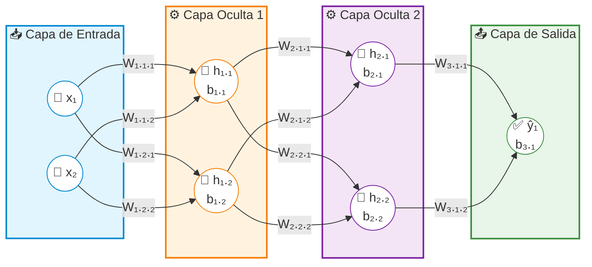

# Arquitectura de una Red Neuronal Artificial

**AUTOR:** **[HADSON PAREDES](https://www.linkedin.com/in/hadson-paredes/) - 2025**

Una **red neuronal artificial** es un modelo de computación inspirado en el _**cerebro humano**_ que procesa datos mediante nodos interconectados llamados _**neuronas artificiales**_.

La arquitectura de una **`red neuronal artificial`** se define como la **estructura** y **organización** de sus capas de nodos interconectados (neuronas artificiales), compuestas típicamente por una **capa de entrada**, **una o varias (multiples) capas ocultas** y una capa de salida.

## Componentes Estructurales Básicos:

* **Capa de entrada:** Recibe los datos originales o características iniciales sin procesar.
* **Capas ocultas:** Capas intermedias que realizan transformaciones lineales y aplican [funciones de activación](02.funciones-de-activacion.md) no lineal (como `ReLU`, `sigmoide` o `tanh`) para detectar patrones complejos.
* **Capa de salida:** Genera la predicción o resultado final del modelo.
* **Pesos ($W$) y sesgos ($b$):** Parámetros ajustables que determinan la fuerza de las conexiones y los umbrales de activación entre neuronas.

## Diagrama según componentes estructurales básicos

Las etiquetas matemáticas correspondientes a los **pesos ($W$)** en los canales de transmisión (flechas) y los **sesgos ($b$)** dentro de los nodos de procesamiento de las capas ocultas y de salida de una **`red neuronal artificial`**:

### Notación Matemática:

* **Entradas ($x_i$):** Los nodos de entrada representan los componentes del vector de características de entrada ($x_1, x_2$).
* **Pesos ($W_{capa.destino.origen}$):** Cada línea de conexión muestra su peso matemático. Por ejemplo, $W_{1.2.1}$ es el peso de la **Capa 1**, que va hacia la neurona **destino 2** desde la neurona **origen 1**.
* **Sesgos ($b_{capa.neurona}$):** Se agregan dentro de los círculos de las capas ocultas y de salida (ejemplo: $b_{1.1}$ es el sesgo de la primera neurona en la capa oculta 1), ya que el sesgo se suma directamente en la operación lineal $z = Wx + b$ de cada unidad antes de aplicar la función de activación.
* **Capa de Salida ($\hat{y}_k$ y $b_{3.k}$):** Representa las predicciones estimadas finales del modelo. El nodo contiene la variable de salida $\hat{y}_1$ y su respectivo sesgo final $b_{3.1}$ (donde el subíndice $3$ indica que pertenece a la tercera transición de capas de la red). La salida se calcula aplicando una función de activación final (como `Sigmoide` o `Softmax`) sobre la combinación lineal de los valores de la última capa oculta multiplicados por los pesos $W_{3.1.1}$ y $W_{3.1.2}$.

 

> Se redujo ligeramente la cantidad de nodos (2 entradas, 2 ocultas por capa, 1 salida) para evitar que el exceso de texto de los pesos saturara visualmente el diagrama; su naturaleza de una red neuronal es persistir de uno a multiples capas ocultas.

### Los subíndices se descomponen de la siguiente manera:

En el contexto de las redes neuronales artificiales, las variables **$h$** representan las salidas de las neuronas ocultas (la letra viene del inglés _hidden layer_ o _hidden unit_).

* **La letra $h$:** Representa el valor de activación de una neurona en una capa oculta, es decir, el resultado final después de calcular la combinación lineal de las entradas con sus `pesos` y `sesgos` ($z = Wx + b$) y pasar ese resultado por una función de activación (como `ReLU` o `Sigmoide`).
* **El primer subíndice (Capa):** Indica a qué capa oculta pertenece la neurona.
* **El segundo subíndice (Posición):** Indica el número o posición de la neurona dentro de esa capa específica.

**Desglose por capas:**

**$h_{1.1}$:** Es la activación de la **neurona 1** de la **capa oculta 1**.

**$h_{1.2}$:** Es la activación de la **neurona 2** de la **capa oculta 1**.

Estas variables actúan como "características intermedias" o representaciones que la red va descubriendo por sí misma para aprender patrones complejos antes de enviar la información a la capa de salida.

## Resumen:

La **arquitectura de una Red Neuronal Artificial** organiza nodos interconectados en tres niveles principales: **capa de entrada (recibe datos), capas ocultas (procesan información) y capa de salida (genera la predicción)**. Su funcionamiento se rige por parámetros matemáticos ajustables: los **pesos ($W$)**, que miden la fuerza de las conexiones, y los **sesgos ($b$)**, que fijan los umbrales de activación en cada nodo.
La información fluye a través de operaciones lineales ponderadas ($z = Wx + b$). Los subíndices matemáticos detallan esta estructura; por ejemplo, $W_{1.2.1}$ conecta la neurona origen 1 con la destino 2 en la capa 1, mientras que $b_{1.1}$ es el sesgo del primer nodo oculto. Las variables $h_{capa.posicion}$ (como $h_{1.1}$) representan las **activaciones ocultas**, que son transformaciones no lineales intermedias que extraen características esenciales antes de producir la estimación final ($\hat{y}$).

### Publicaciones en mis redes sociales:

**Sígueme en mis redes sociales**

 
 

