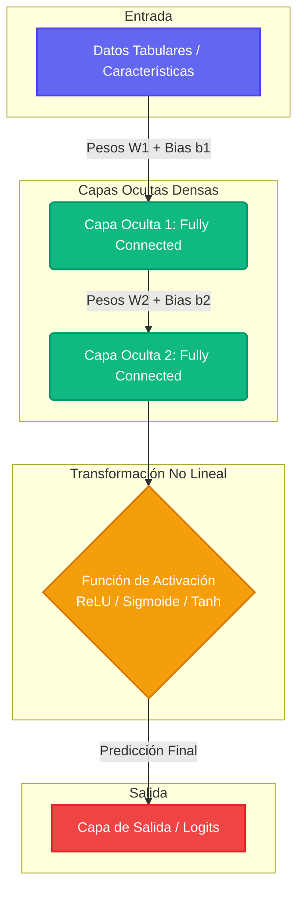
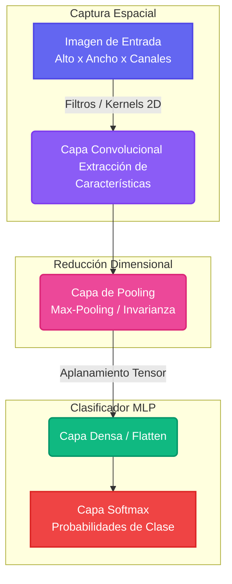
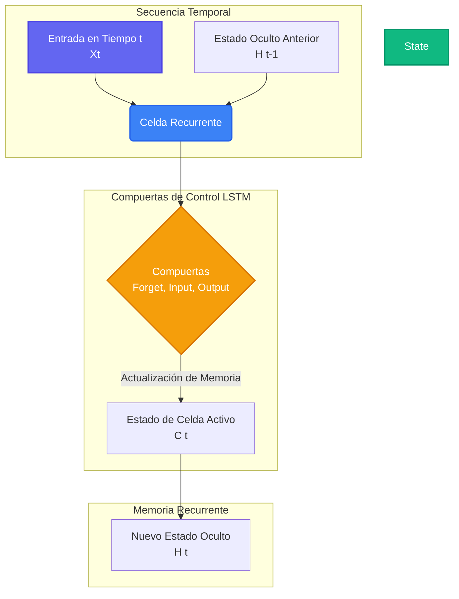
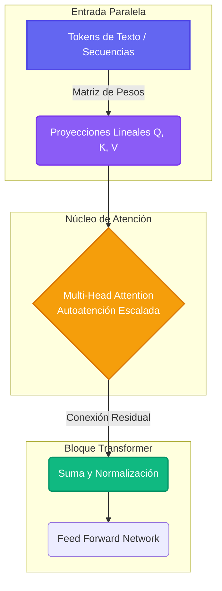
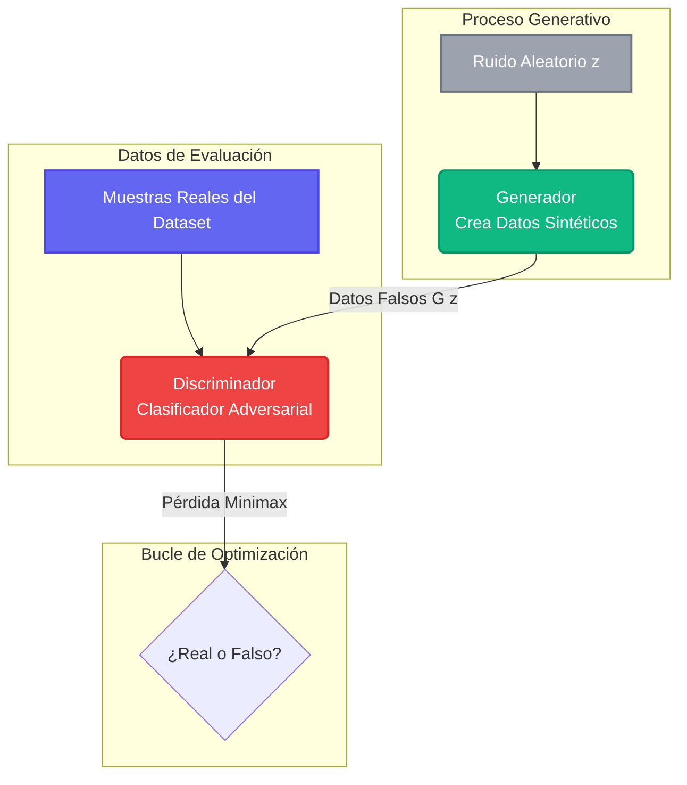
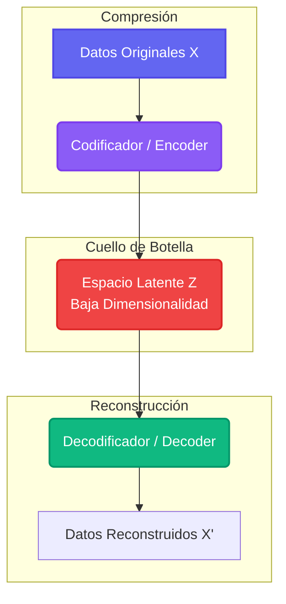

# TIPOS DE DEEP LEARNING

Revisaremos conceptos fundamental de **Deep Learning** contemplando la teórico, conceptos o formulas matemáticas y algunos ejemplos práctico. Cada concepto incluye sus ecuaciones matemáticas, código en Python puro (o utilizando NumPy/PyTorch), casos de estudio reales y arquitectutas. Asimismo, revisaremos modelos avanzado y genericos, y para finalizar ampliaremos este articulo con algunas técnicas de entrenamiento y herramientas.

# Tipo 1: Perceptrón y Neuronas Artificiales

## 1.1 Modelo Básico y Suma Ponderada

La neurona artificial (o Perceptrón) es la **unidad mínima de procesamiento en _Deep Learning_**. Funciona tomando un vector de entradas $x = [x_1, x_2, ..., x_n]^T$, multiplicándolo por un vector de pesos $w = [w_1, w_2, ..., w_n]^T$ y sumando un sesgo o bias ($b$).
La combinación lineal de estos elementos se conoce como la **Suma Ponderada** ($z$):

$$z = \sum_{i=1}^{n} w_i x_i + b = w^T x + b$$

* **Pesos ($w$):** Representan la fuerza o importancia de cada canal de entrada.
* **Sesgo ($b$):** Permite desplazar la función de activación hacia la izquierda o derecha para ajustar el umbral de activación de la neurona independientemente de las entradas.

## 1.2 Funciones de Activación

Para que una red neuronal pueda aprender relaciones complejas y no lineales, la suma ponderada $z$ debe pasar por una **función de activación $\sigma(z)$**. Sin ellas, una red de 100 capas equivaldría matemáticamente a una sola capa lineal ($y = Wx + b$).
A continuación, se detallan las cuatro funciones de activación más utilizadas, sus ecuaciones, derivadas y limitaciones:

### 1.2.1. Sigmoide (Logistic)
Transforma cualquier valor real al rango $(0, 1)$, ideal para interpretar la salida como una probabilidad en clasificación binaria.

* **Fórmula:**

$$\sigma(z) = \frac{1}{1 + e^{-z}}$$

* **Derivada:**

$$\sigma'(z) = \sigma(z)(1 - \sigma(z))$$

* **Problema principal:** Sufre de Desvanecimiento del Gradiente (_Vanishing Gradient_). Si $z$ es muy grande o muy pequeño, la pendiente (derivada) es casi cero, deteniendo el aprendizaje de la red.

### 1.2.2. Tangente Hiperbólica (Tanh)
Similar a la Sigmoide, pero escala los valores al rango $(-1, 1)$. Al estar centrada en cero, ayuda a que las actualizaciones de los pesos en capas profundas sean más estables.

* **Fórmula:**

$$\tanh(z) = \frac{e^z - e^{-z}}{e^z + e^{-z}}$$

* **Derivada:**

$$\tanh'(z) = 1 - \tanh^2(z)$$

* **Problema principal:** Al igual que la Sigmoide, se satura en los extremos y causa desvanecimiento del gradiente.

### 1.2.3. ReLU (Rectified Linear Unit)

Es el estándar de la industria para capas ocultas. Si la entrada es negativa, la salida es cero; si es positiva, deja pasar el valor tal cual. Es computacionalmente muy barata de calcular.

* **Fórmula:**

$$f(z) = \max(0, z)$$

* **Derivada:**

$$f'(z) = \begin{cases} 1 & \text{si } z > 0 \\ 0 & \text{si } z < 0 \end{cases}$$

* **Problema principal:** Dying ReLU. Si una neurona recibe gradientes negativos muy grandes, sus pesos se ajustan de modo que siempre devuelva 0. Al tener derivada 0 en la zona negativa, esa neurona "muere" y no vuelve a aprender.

### 1.2.4. Softmax

Utilizada exclusivamente en la **capa de salida** para clasificación multiclase (más de 2 categorías mutuamente excluyentes). Normaliza un vector de puntuaciones (_logits_) en una distribución de probabilidad que suma exactamente 1.

* **Fórmula (para la componente $i$):**
$$\text{Softmax}(z_i) = \frac{e^{z_i}}{\sum_{j=1}^{K} e^{z_j}}$$

* **Propiedad:** Garantiza que $0 \le P(y=i\vert{}x) \le 1$ y $\sum P = 1$.

### 1.3 Implementación en Python (Desde Cero con NumPy)

El siguiente script define estas funciones, sus derivadas y cómo procesar un pase hacia adelante (_Forward Pass_) de un perceptrón:

```python
import numpy as np

# 1. Definición de Funciones de Activación y sus derivadas
def sigmoid(z, derivative=False):
    s = 1 / (1 + np.exp(-z))
    if derivative:
        return s * (1 - s)
    return s

def tanh(z, derivative=False):
    t = np.tanh(z)
    if derivative:
        return 1 - t**2
    return t

def relu(z, derivative=False):
    if derivative:
        return np.where(z > 0, 1, 0)
    return np.maximum(0, z)

def softmax(z):
    # Restamos el max por estabilidad numérica (evita overflow por exponenciales)
    exp_z = np.exp(z - np.max(z, axis=-1, keepdims=True))
    return exp_z / np.sum(exp_z, axis=-1, keepdims=True)

# 2. Simulación de un pase hacia adelante (Forward Pass) de 1 capa
np.random.seed(42)

# Datos de entrada: 3 muestras, cada una con 4 características
X = np.random.randn(3, 4) 

# Pesos y sesgos para una capa oculta con 3 neuronas
W = np.random.randn(4, 3)
b = np.zeros((1, 3))

# Suma ponderada (Z = XW + b)
Z = np.dot(X, W) + b

# Activación con ReLU
A = relu(Z)

print("Entradas X:\n", X)
print("\nSuma Ponderada Z:\n", Z)
print("\nActivación Oculta (ReLU) A:\n", A)
```

<br/><br/>

# 📉 Módulo 2: Optimización y Entrenamiento

## 2.1 Descenso del Gradiente y Tasa de Aprendizaje ($\eta$ o $\alpha$)

Para entrenar una red, definimos una **Función de Pérdida** ($J(W)$) que mide qué tan erróneas son las predicciones (por ejemplo, el Error Cuadrático Medio o la Entropía Cruzada). El Descenso del Gradiente busca los pesos mínimos de esta función moviéndose en la dirección opuesta al vector gradiente $\nabla J(W)$.

La regla de actualización para un parámetro $w$ es:

$$w := w - \eta \frac{\partial J}{\partial w}$$

* **Tasa de aprendizaje ($\eta$):** Controla el tamaño del paso. Si es **muy alta**, el algoritmo oscilará y divergirá, perdiendo el mínimo. Si es **muy baja**, el entrenamiento será extremadamente lento y podría estancarse en mínimos locales o puntos de silla.

## 2.2 Propagación hacia Atrás (Backpropagation)

Es el algoritmo clave que utiliza la **Regla de la Cadena** del cálculo multivariable para calcular eficientemente las derivadas parciales de la función de pérdida con respecto a cada peso y sesgo de la red, desde la última capa hasta la primera.

### Ejemplo Matemático en una Red de 1 Neurona:

Imagina un cálculo simple: Entrada $x \rightarrow$ Suma $z = wx+b \rightarrow$ Activación $a = \sigma(z) \rightarrow$ Pérdida $L = \frac{1}{2}(a - y)^2$.

Queremos calcular cuánto afecta el peso $w$ a la pérdida total, es decir, $\frac{\partial L}{\partial w}$.

**Por regla de la cadena:**

$$\frac{\partial L}{\partial w} = \frac{\partial L}{\partial a} \cdot \frac{\partial a}{\partial z} \cdot \frac{\partial z}{\partial w}$$

Calculando cada término individual:

   1. $\frac{\partial L}{\partial a} = (a - y)$
   2. $\frac{\partial a}{\partial z} = \sigma'(z)$
   3. $\frac{\partial z}{\partial w} = x$

Uniendo todo:

$$\frac{\partial L}{\partial w} = (a - y) \cdot \sigma'(z) \cdot x$$

## 2.3 Regularización: Dropout

El sobreajuste (_Overfitting_) ocurre cuando la red memoriza los datos de entrenamiento en lugar de generalizar. **Dropout** es una técnica de regularización que, durante cada iteración del entrenamiento, desactiva aleatoriamente un porcentaje $p$ de neuronas en una capa.

* **Efecto:** Fuerza a la red a aprender representaciones redundantes y robustas, impidiendo que dependa excesivamente de características o neuronas específicas.
* **Nota clave:** Dropout **solo se activa en entrenamiento**. Durante la inferencia (evaluación), todas las neuronas se reactivan, pero sus salidas se escalan multiplicándolas por $(1-p)$ para compensar la falta de desactivaciones.

## 2.4 Ejemplo Práctico en PyTorch (Entrenamiento Completo con Dropout)

```python
import torch
import torch.nn as nn
import torch.optim as optim

# 1. Crear una arquitectura con Capas Lineales, ReLU y Dropout
class SimpleMLP(nn.Module):
    def __init__(self, input_size, hidden_size, output_size):
        super(SimpleMLP, self).__init__()
        self.fc1 = nn.Linear(input_size, hidden_size)
        self.relu = nn.ReLU()
        self.dropout = nn.Dropout(p=0.3)  # 30% de probabilidad de apagar neuronas
        self.fc2 = nn.Linear(hidden_size, output_size)
        
    def forward(self, x):
        out = self.fc1(x)
        out = self.relu(out)
        out = self.dropout(out) # Aplicado solo en train mode
        out = self.fc2(out)
        return out

# 2. Configurar hiperparámetros
X_train = torch.randn(100, 10)  # 100 muestras, 10 características
Y_train = torch.randint(0, 2, (100,))  # Clasificación binaria (0 o 1)

model = SimpleMLP(input_size=10, hidden_size=16, output_size=2)
criterion = nn.CrossEntropyLoss()
optimizer = optim.SGD(model.parameters(), lr=0.01) # Descenso del gradiente estocástico

# 3. Bucle de entrenamiento (Epochs)
model.train() # Activa Dropout
for epoch in range(5):
    optimizer.zero_grad()               # Limpiar gradientes anteriores
    outputs = model(X_train)            # Forward Pass
    loss = criterion(outputs, Y_train)  # Calcular Pérdida
    loss.backward()                     # Backpropagation (Calcula gradientes)
    optimizer.step()                    # Actualizar pesos usando SGD
    print(f"Epoch {epoch+1}/5 - Loss: {loss.item():.4f}")

```
<br/><br/>

# ⚖️ Módulo 3: Normalización (Batch Normalization)

## 3.1 El problema del "Internal Covariate Shift"

A medida que una red profunda entrena, los pesos de las primeras capas cambian constantemente. Esto altera drásticamente la distribución de las entradas que reciben las capas superiores en cada paso, obligándolas a adaptarse continuamente a un objetivo móvil. Esto ralentiza el entrenamiento de forma crítica.

## 3.2 El mecanismo de Batch Normalization (BatchNorm)

**Batch Normalization (Sergey Ioffe y Christian Szegedy, 2015)** soluciona esto normalizando las activaciones de una capa intermedia para un "mini-lote" (batch) de datos.

Dado un mini-lote de valores $B = \{z_1, ..., z_m\}$ en una neurona:

   1. **Media del lote:**

   $$\mu_B = \frac{1}{m}\sum_{i=1}^{m} z_i$$

   2. **Varianza del lote:**

   $$\sigma_B^2 = \frac{1}{m}\sum_{i=1}^{m} (z_i - \mu_B)^2$$

   3. **Normalización:**

   $$\hat{z}_i = \frac{z_i - \mu_B}{\sqrt{\sigma_B^2 + \epsilon}}$$

   (donde $\epsilon$ es una constante pequeña para evitar división por cero)

   4. **Escalamiento y Desplazamiento:**

   $$y_i = \gamma \hat{z}_i + \beta$$


* **¿Por qué $\gamma$ y $\beta$?** Son parámetros **entrenables** (la red los aprende por backpropagation). Permiten que la red anule la normalización si descubre matemáticamente que la distribución original sin normalizar era mejor para reducir el error.

### Beneficios de BatchNorm:

* Permite usar **tasas de aprendizaje mucho más altas** sin riesgo de divergencia.
* Reduce drásticamente la dependencia de una inicialización ultra-precisa de pesos.
* Actúa como un regularizador ligero (reduce la necesidad extrema de usar Dropout).

<br/><br/>

# 💼 Caso de Estudio: Predicción del Riesgo de Impago de Créditos Bancarios

## Contexto de Negocio

Un banco masivo digital desea reducir su tasa de morosidad. Tienen un conjunto de datos histórico con 500,000 clientes, cada uno descrito por 30 variables continuas (ingresos, edad, deudas actuales, puntuación de historial crediticio, etc.). El objetivo es predecir si un nuevo solicitante incurrirá en impago (**0 = Paga a tiempo, 1 = No paga**).

## Justificación de la Arquitectura Deep Learning

Se opta por una red densa multicapa (_MLP_) profunda debido a la alta cantidad de registros.

* **Estrategia frente al desvanecimiento del gradiente:** Usamos **ReLU** en las capas ocultas en lugar de Sigmoide, para asegurar que los gradientes fluyan con fuerza hacia las capas iniciales.
* **Aceleración de convergencia:** Al ser datos financieros altamente correlacionados y con escalas dispares (ej. Ingresos en miles vs Edad en decenas), se inserta **Batch Normalization** inmediatamente antes de cada ReLU. Esto estabiliza las distribuciones y nos permite aumentar el learning rate de $0.001$ a $0.01$, logrando que la red converja en la mitad de tiempo.
* **Control del riesgo de sobreajuste:** Debido a la enorme capacidad de memorización de la red, se añade **Dropout (0.25)** para evitar que el banco memorice clientes específicos de alto perfil y falle al generalizar con clientes nuevos.
* **Capa de salida:** Se configura con una neurona con activación **Sigmoide** (o 2 salidas con **Softmax**) para extraer de manera directa el porcentaje exacto de probabilidad de riesgo crediticio del aplicante.

<br/><br/>

# PRINCIPALES ARQUITECTURA DE DEEP LEARNING

Para comprender la evolución moderna del **Deep Learning**, debemos analizar cómo la comunidad científica diseñó arquitecturas específicas para romper las limitaciones del **Perceptrón Multicapa (MLP)** convencional ante datos complejos (imágenes, secuencias o generación).

A continuación, profundizamos en cada una de las arquitecturas principales mediante su sustento teórico, ecuaciones fundamentales, casos de uso y ejemplos prácticos en PyTorch.

## 🧠 1. Redes Neuronales Profundas (DNN / MLP)

Las **Multi-Layer Perceptrons (MLP)** son redes densas totalmente conectadas (_Fully Connected_). Cada neurona de la capa $l$ se conecta con absolutamente todas las neuronas de la capa $l-1$.

* **Mecanismo:** Mapean un vector de entrada a un vector de salida mediante transformaciones lineales sucesivas seguidas de funciones de activación no lineales.
* **Ecuación de la Capa $l$:**

$$a^{[l]} = \sigma\left(W^{[l]} a^{[l-1]} + b^{[l]}\right)$$

* **Limitación:** No escalan bien con datos espaciales o temporales. Si introduces una imagen de $1024 \times 1024$ píxeles a color, la primera capa requeriría más de 3 millones de pesos por cada neurona, destruyendo la eficiencia computacional y causando un sobreajuste masivo (_overfitting_).

* **Caso de uso ideal: Datos tabulares estructurados** (tablas SQL, archivos CSV financieros) donde las relaciones entre columnas no dependen del orden ni de la vecindad espacial.

## 🖼️ 2. Redes Neuronales Convolucionales (CNN)

Diseñadas específicamente para **datos con estructura de cuadrícula** (como imágenes), las CNN rompen la necesidad de conectar todo con todo mediante dos principios: **compartición de pesos y localidad espacial**.

### Conceptos Clave

* **Convolución ($*$):** Un filtro o _kernel_ (una matriz pequeña de pesos, por ejemplo, de $3 \times 3$) se desliza sobre la imagen. Realiza una suma del producto elemento a elemento para detectar características locales como bordes, texturas o formas.

* **Ecuación de Convolución 2D (Sencilla):**

$$S(i,j) = (I * K)(i,j) = \sum_{m} \sum_{n} I(i-m, j-n) K(m,n)$$

* **Stride (Zancada):** El número de píxeles que el filtro se desplaza en cada paso.
* **Padding (Acolchado):** Agregar bordes de ceros a la imagen para controlar el tamaño del mapa de características resultante.
* **Pooling (Agrupación):** Capas de reducción (usualmente Max-Pooling) que extraen el valor máximo de una ventana, otorgando **invarianza a la traslación** (detecta el objeto sin importar en qué esquina de la imagen se encuentre) y reduciendo el costo computacional.

### Ejemplo en PyTorch (Clasificación de Imágenes)

```python
import torch
import torch.nn as nn

class SimpleCNN(nn.Module):
    def __init__(self, num_classes=10):
        super(SimpleCNN, self).__init__()
        # Entrada: [Batch, 3 canales (RGB), 32x32 píxeles]
        self.conv1 = nn.Conv2d(in_channels=3, out_channels=16, kernel_size=3, stride=1, padding=1)
        self.relu = nn.ReLU()
        self.pool = nn.MaxPool2d(kernel_size=2, stride=2) # Reduce dimensiones a la mitad (16x16)
        
        # Capa totalmente conectada (Aplanamos el tensor resultante)
        self.fc = nn.Linear(16 * 16 * 16, num_classes)
        
    def forward(self, x):
        x = self.pool(self.relu(self.conv1(x)))
        x = x.view(x.size(0), -1) # Aplanar (Flatten)
        x = self.fc(x)
        return x

```

## 🕒 3. Redes Neuronales Recurrentes (RNN, LSTM, GRU)

Las redes tradicionales asumen que las entradas son independientes. Las **RNN** rompen esto introduciendo un **estado oculto ($h_t$)** que actúa como "memoria", permitiendo procesar secuencias de longitud variable (texto, audio, series temporales).

```text
   x_t ---> [ RNN Cell ] ---> h_t
                ^
                | (Retroalimentación temporal)
```

### El problema del gradiente desvaneciente en RNN

Al entrenar secuencias largas utilizando _Backpropagation Through Time (BPTT)_, multiplicas repetidamente las matrices de pesos. Si los valores son ligeramente menores a 1, el gradiente decae exponencialmente a cero. La red "olvida" lo que pasó al inicio del texto.

### Variantes avanzadas: LSTM y GRU

Para solucionarlo, se diseñaron mecanismos de compuertas (gates) que controlan matemáticamente qué información fluye, se borra o se mantiene.

### Long Short-Term Memory (LSTM)

Introduce la celda de estado ($C_t$) (una autopista de memoria a largo plazo) regulada por tres compuertas:

   1. **Forget Gate ($f_t$):** Decide qué olvidar del pasado: $f_t = \sigma(W_f [h_{t-1}, x_t] + b_f)$.
   2. **Input Gate ($i_t$):** Decide qué nueva información guardar en la memoria.
   3. **Output Gate ($o_t$):** Decide qué parte del estado de la celda se muestra en el nuevo estado oculto $h_t$.

### Gated Recurrent Unit (GRU)

Es una variante simplificada y más rápida que fusiona el estado de la celda y el oculto. Usa solo dos compuertas: **Reset Gate** (qué tanto del pasado olvidar) y **Update Gate** (qué tanto del estado actual mantener).

## 🤖 4. Mecanismos de Atención y Transformers

Aunque las LSTM mejoraron las secuencias, sufren de un problema: **son secuenciales**. No puedes procesar la palabra 100 de un texto sin haber procesado las 99 anteriores, lo que impide el entrenamiento masivo en paralelo.

Los **Transformers (Vaswani et al., 2017)** eliminaron la recursión por completo reemplazándola con el mecanismo de **Autoatención (Self-Attention)**.

### Autoatención por Producto Escalar Escalado

Cada palabra en una secuencia se proyecta en tres vectores mediante matrices de pesos entrenables: **Query ($Q$), Key ($K$) y Value ($V$)**.

* **Concepto:** La palabra actual de consulta ($Q$) evalúa su afinidad matemática contra todas las claves ($K$) de las demás palabras para determinar cuánta atención prestarles. Luego, pondera los valores ($V$) en función de esa atención.

$$\text{Attention}(Q, K, V) = \text{Softmax}\left(\frac{QK^T}{\sqrt{d_k}}\right)V$$

(Donde $\sqrt{d_k}$ es un factor de escala para evitar que los gradientes de Softmax se vuelvan demasiado pequeños).

* **Impacto moderno:** Es la arquitectura detrás de todos los modelos de lenguaje modernos (GPT, Claude, Llama). Permite procesar contextos gigantescos en paralelo gracias al hardware moderno (GPUs).

## 🎭 5. Redes Generativas Antagónicas (GAN)

Propuestas por Ian Goodfellow en 2014, las GAN abordan el aprendizaje no supervisado mediante una **teoría de juegos de suma cero**, donde dos redes compiten entre sí:

```text
[Ruido Aleatorio z] ---> (Generador) ---> [Imagen Falsa] ---\
                                                             ---> (Discriminador) ---> ¿Real o Falsa?
                                       [Imágenes Reales] ---/
```

1. **El Generador ($G$):** Intenta crear datos falsos (ej. rostros humanos) tan realistas que logren engañar al Discriminador. Su entrada es ruido aleatorio $z$.
2. **El Discriminador ($D$):** Es un clasificador binario. Su trabajo es aprender a distinguir si una imagen proviene del conjunto de datos real (Salida = 1) o si fue fabricada por el Generador (Salida = 0).

### Función de Pérdida Minimax

Ambas redes se entrenan simultáneamente optimizando la función:

$$\min_G \max_D V(D, G) = \mathbb{E}_{x \sim p_{data}}[\log D(x)] + \mathbb{E}_{z \sim p_z}[\log(1 - D(G(z)))]$$

* $D$ busca maximizar la probabilidad de acertar.
* $G$ busca minimizar el éxito de $D$ (es decir, maximizar que $D(G(z))$ sea cercano a 1).

## 🗜️ 6. Autoencoders (AE)
Un Autoencoder es una red neuronal diseñada para aprender codificaciones eficientes de datos de forma no supervisada. Su meta es **reconstruir su propia entrada** en la capa de salida.

```text
Entrada (X) ---> [ Codificador ] ---> Espacio Latente (Z) ---> [ Decodificador ] ---> Salida Reconstruida (X')
```

### Componentes

* **Encoder (Codificador):** Comprime la entrada $X$ de alta dimensión en una representación de baja dimensión $Z$ (llamada cuello de botella o espacio latente).
* **Decoder (Decodificador):** Toma el vector comprimido $Z$ e intenta reconstruir la entrada original de la forma más exacta posible ($\hat{X}$).
* **Función de Pérdida:** Mide la diferencia entre el original y la reconstrucción: $L(x, \hat{x}) = \Vert{}x - \hat{x}\Vert{}^2$.

### Aplicaciones reales

Si el espacio latente es menor que la dimensión de entrada, la red se ve obligada a descartar el "ruido" y capturar únicamente las características estructurales más importantes del dato.

* **Reducción de dimensionalidad no lineal** (superando a PCA tradicional).
* **Denoising (Eliminación de ruido):** Se le introduce una imagen pixelada o corrupta y se entrena para devolver la versión limpia.

## 📊 Tabla Comparativa de Arquitecturas

| Arquitectura | Tipo de Datos Primario | Ventaja Principal | Desventaja Crítica |
|---|---|---|---|
| **MLP / DNN** | Tabular / Estructurado | Simplicidad, mapeo directo. | No escala con datos espaciales/secuenciales. |
| **CNN** | Imágenes / Video / Audio | Invarianza espacial, pocos parámetros. | Falla si el contexto global es muy lejano. |
| **RNN / LSTM** | Texto / Series Temporales | Memoria interna de orden temporal. | Lenta de entrenar (no paralelizable). |
| **Transformers** | Texto / Multimodal | Paralelización masiva, atención global. | Costo computacional cuadrático con el contexto. |
| **GAN** | Generación de Contenido | Resultados visuales de alta fidelidad. | Entrenamiento inestable (Mode Collapse). |
| **Autoencoders** | Compresión / Imágenes | Excelente para reducción de ruido. | Tiende a generar salidas borrosas. |

# DIAGRAMA DE ARQUITECTURA DE DEEP LEARNING

A continuación, se presentan los diagramas para cada una de las principales arquitecturas de Deep Learning; asimismo agregamos resúmenes y el detalle de sus componentes que conforman cada diagrama.

## 1. Redes Neuronales Profundas (DNN / MLP)

Esta arquitectura procesa datos de forma secuencial y unidireccional. Mapea características de entrada mediante capas ocultas densamente conectadas que multiplican matrices de pesos y aplican funciones de activación no lineales, optimizando problemas de clasificación o regresión con datos tabulares estructurados.




* **Detalle del diagrama:**

    * **`Entrada (Azul):`** Representa el vector inicial de características numéricas.
    * **`Capas Ocultas (Verde):`** Neuronas totalmente conectadas (_Fully Connected_) que realizan sumas ponderadas ($W \cdot x + b$).
    * **`Transformación (Naranja):`** Rompe la linealidad de la red mediante funciones como ReLU.
    * **`Salida (Rojo):`** Ofrece la predicción final o probabilidad mapeada.

* **Enlaces de confianza:** Puede profundizar sobre este modelo en la guía detallada de [GeeksforGeeks Feedforward Networks](https://www.geeksforgeeks.org/deep-learning/types-of-neural-networks/) y explorar su lógica operativa en la documentación técnica de [Creately Neural Networks](https://creately.com/guides/neural-network-diagram/).


## 2. Redes Neuronales Convolucionales (CNN)

Red especializada en el procesamiento de datos con cuadrículas espaciales como imágenes. Utiliza filtros convolucionales reutilizables para extraer patrones geométricos locales (bordes y texturas) y capas de pooling para reducir dimensiones, preservando la invarianza a traslaciones espaciales.



* **Detalle del diagrama:**
    * **`Entrada (Azul):`** Matriz tridimensional que representa los píxeles de una imagen.
    * **`Convolución (Morado):`** Aplicación de operaciones matriciales con kernels de pesos compartidos.
    * **`Pooling (Rosa):`** Compresión espacial que descarta redundancia y se queda con valores máximos.
    * **`Clasificador (Verde/Rojo):`** Red neuronal densa que recibe el tensor aplanado para la predicción multiclase.

* **Enlaces de confianza:** Consulte la estructura matemática en el portal de [GeeksforGeeks CNN Overview](https://www.geeksforgeeks.org/deep-learning/deep-learning-tutorial/) o revise implementaciones visuales en los diagramas de [ConceptViz CNN Architectures](https://conceptviz.app/blog/how-to-draw-neural-network-architecture-diagram-guide).


## 3. Redes Neuronales Recurrentes (RNN, LSTM, GRU)

Arquitectura optimizada para procesar datos secuenciales y temporales de longitud variable como texto o audio. Mantiene una memoria interna dinámica que, mediante compuertas de control en variantes avanzadas (LSTM/GRU), regula el flujo de información a largo plazo mitigando gradientes desvanecientes.



* **Detalle del diagrama:**

    * **`Secuencia (Azul):`** Recibe de manera coordinada la entrada actual y la memoria del pasado inmediato.
    * **`Compuertas (Naranja):`** Mecanismos matemáticos (Sigmoide/Tanh) que deciden qué olvidar o añadir a la celda.
    * **`Memoria (Verde):`** Autopistas de datos que transmiten la información crítica a los siguientes pasos de tiempo.

* **Enlaces de confianza:** Lea más sobre mitigación de gradientes en GeeksforGeeks RNN & LSTM Models o inspeccione esquemas de celdas temporales en [SciDraw AI Neural Networks](https://sci-draw.com/neural-network-diagram-generator).


## 4. Mecanismos de Atención y Transformers

Revolucionaria arquitectura que elimina la recursividad temporal sustituyéndola por procesamiento en paralelo masivo. Emplea mecanismos de autoatención para calcular dependencias contextuales globales e instantáneas entre todas las palabras de una secuencia, impulsando los modelos de lenguaje modernos.



* **Detalle del diagrama:**
    * **`Proyecciones (Morado):`** Transformación de tokens en vectores consulta (Query), clave (Key) y valor (Value).
    * **`Atención (Naranja):`** Evaluación relacional cruzada que pondera el peso contextual de cada elemento.
    * **`Bloque (Verde):`** Capas de normalización y redes internas que estabilizan los gradientes profundos. 

* **Enlaces de confianza:** Descubra el impacto de la autoatención en [Syracuse University Neural Networks Guide](https://ischool.syracuse.edu/types-of-neural-networks/) y analice arquitecturas de gran escala en ConceptViz Transformer Visualizations.


## 5. Redes Generativas Antagónicas (GAN)

Modelo de aprendizaje no supervisado basado en la teoría de juegos, donde dos redes compiten en un bucle adversarial. El generador fabrica datos sintéticos realistas a partir de ruido, mientras el discriminador intenta detectar falsificaciones, optimizando la fidelidad de los datos.



* **Detalle del diagrama:**
    * **`Generador (Verde):`** Red encargada de mapear ruido en distribuciones complejas idénticas a la realidad.
    * **`Discriminador (Rojo):`** Crítico binario entrenado para penalizar los fallos estructurales del generador.
    * **`Evaluación (Gris/Azul):`** Flujo donde colisionan los datos del mundo real frente a los generados de forma artificial. [11] 

* **Enlaces de confianza:** Explore la formulación de pérdidas en la enciclopedia de [GeeksforGeeks GAN Architectures](https://www.geeksforgeeks.org/deep-learning/generative-adversarial-network-gan/) y visualice flujos competitivos en [SciDraw AI Diagram Solutions](https://sci-draw.com/blog/neural-network-diagram-prompts).


## 6. Autoencoders (AE)

Red neuronal auto-supervisada configurada con una geometría simétrica de reloj de arena. Su codificador comprime las entradas en un espacio latente compacto de baja dimensionalidad, obligando al decodificador a reconstruir la señal original eliminando ruido y extrayendo características esenciales.



* **Detalle del diagrama:**

    * **`Encoder (Morado):`** Fase que reduce progresivamente las dimensiones del tensor de entrada.
    * **`Espacio Latente (Rojo):`** El cuello de botella donde residen las variables comprimidas cruciales.
    * **`Decoder (Verde):`** Fase expansiva que recrea los datos intentando minimizar el error de reconstrucción.

* **Referencia:** Profundice en aplicaciones de reducción de ruido en [IBM Deep Learning Architectures](https://developer.ibm.com/articles/cc-machine-learning-deep-learning-architectures/) o examine esquemas de espacios latentes en [GitHub Kennethleungty Neural Diagrams](https://github.com/kennethleungty/Neural-Network-Architecture-Diagrams).

<br/><br/>

# MODELOS AVANZADOS Y GENERATIVOS

Para dominar el estado del arte en **Deep Learning**, debemos pasar de los modelos predictivos tradicionales (mapeo estático de entradas a salidas) a los **Modelos Avanzados y Generativos**, donde las redes aprenden a modelar la distribución de probabilidad subyacente de los datos para crear nueva información o interactuar en entornos dinámicos de forma autónoma.

A continuación, profundizamos en la teoría matemática, arquitectura, código conceptual y casos de estudio de estos cuatro pilares avanzados.

## 🚀 1. Autoencoders Avanzados: De AE (Autoencoder tradicional) a VAE (Variational Autoencoders)

Mientras que un Autoencoder tradicional (AE) comprime datos mapeándolos a un punto fijo en el espacio latente (lo que suele generar un espacio fragmentado y difícil de muestrear), el **Autoencoder Variacional (VAE)** transforma el espacio latente en continuo y probabilístico.

## Sustento Matemático

En lugar de mapear la entrada $x$ a un vector latente fijo $z$, el codificador de un VAE predice dos vectores: un **vector de medias ($\mu$)** y un **vector de desviaciones estándar ($\sigma$)**.

Para poder aplicar Backpropagation, no podemos muestrear directamente de $\mathcal{N}(\mu, \sigma^2)$ porque la operación de muestreo aleatorio no es diferenciable. Se utiliza el **Truco de Reparametrización**:

$$z = \mu + \sigma \odot \epsilon \quad \text{donde } \epsilon \sim \mathcal{N}(0, I)$$

## Función de Pérdida (ELBO)

La pérdida de un VAE combina dos objetivos balanceados:

$$\mathcal{L}_{VAE} = \text{Error de Reconstrucción} + D_{KL}(q_\phi(z\vert{}x) \parallel p(z))$$

* **Error de Reconstrucción:** Típicamente el Error Cuadrático Medio (MSE) o Entropía Cruzada. Asegura que la salida sea idéntica a la entrada.
* **Divergencia de Kullback-Leibler ($D_{KL}$):** Actúa como un regularizador matemático que fuerza a la distribución latente a aproximarse a una distribución normal estándar $\mathcal{N}(0, I)$. Esto evita que los puntos se dispersen infinitamente y elimina los "huecos" en el espacio latente.

## 🎭 2. Redes Generativas Antagónicas (GAN) y Variantes Avanzadas

El modelo original de GAN (2014) revolucionó el diseño generativo, pero sufría de graves problemas como la inestabilidad en el entrenamiento y el **Colapso de Modo (Mode Collapse)**, donde el generador aprende a producir solo un tipo de imagen que engaña al discriminador, ignorando el resto de la diversidad del dataset (por ejemplo, generar solo un número "8" perfecto en un dataset de dígitos del 0 al 9).

## La Evolución: WGAN (Wasserstein GAN)

Para solucionar la inestabilidad, Arjovsky et al. (2017) reemplazaron la divergencia clásica por la **Distancia de Wasserstein (o movimiento de tierra)**.

* **Aporte:** Mide la distancia entre distribuciones incluso si no se superponen, proporcionando gradientes suaves y continuos al generador durante todo el entrenamiento.
* **Cambio estructural:** El Discriminador pasa a llamarse **Crítico**, ya que no clasifica (0 o 1), sino que calcula un puntaje de realismo escalar.

## Código Conceptual de una GAN Básica (PyTorch)

```python
import torch
import torch.nn as nn

# Generador: Transforma ruido latente en un vector de datos (ej. imagen aplanada)
class Generator(nn.Module):
    def __init__(self, latent_dim, target_dim):
        super().__init__()
        self.net = nn.Sequential(
            nn.Linear(latent_dim, 128),
            nn.ReLU(),
            nn.Linear(128, target_dim),
            nn.Tanh() # Escala la salida al rango [-1, 1]
        )
    def forward(self, z): return self.net(z)

# Discriminador: Clasificador binario (1 = Real, 0 = Falso)
class Discriminator(nn.Module):
    def __init__(self, input_dim):
        super().__init__()
        self.net = nn.Sequential(
            nn.Linear(input_dim, 128),
            nn.LeakyReLU(0.2),
            nn.Linear(128, 1),
            nn.Sigmoid()
        )
    def forward(self, x): return self.net(x)

```

## 🌫️ 3. Modelos de Difusión (Denoising Diffusion Probabilistic Models - DDPM)

Son la tecnología detrás de herramientas modernas como **Stable Diffusion** o **Midjourney**. Superan a las GAN en estabilidad y diversidad de muestras, aunque requieren un coste computacional mucho más elevado.

```text
Proceso Forward (Añadir Ruido): [Imagen Limpia x0] -------------> [x1] -------------> [Ruido Puro xT]
Proceso Reverse (Eliminar Ruido): [Imagen Limpia x0] <--- (UNet) <--- [x1] <--- (UNet) <--- [Ruido Puro xT]
```

## Mecanismo Operativo

Consta de dos fases matemáticas inversas:

1. **Proceso Forward (Hacia adelante):** Se toma una imagen real y se le añade ruido gaussiano de forma controlada a lo largo de $T$ pasos de tiempo, hasta que la imagen se convierte por completo en ruido puro.
2. **Proceso Reverse (Inverso):** Una red neuronal (típicamente una arquitectura **U-Net**) se entrena para hacer lo contrario: **predecir exactamente cuánto ruido se añadió en el paso $t$** para poder restarlo.

Partiendo de un bloque de ruido aleatorio puro y aplicando la red repetidamente a la inversa, el sistema genera imágenes de un fotorrealismo asombroso a partir de la nada.


## 🕹️ 4. Deep Reinforcement Learning (DRL)

El **Aprendizaje por Refuerzo Profundo** combina la percepción del Deep Learning con la toma de decisiones del Reinforcement Learning. Un **Agente** interactúa con un **Entorno** ejecutando **Acciones** para maximizar una **Recompensa** acumulada a lo largo del tiempo.

## Ecuación de Bellman y Q-Learning Profundo (DQN)

En entornos complejos (como videojuegos de Atari o control robótico), el número de estados posibles es infinito, por lo que no se puede usar una tabla. **DQN (Deep Q-Networks)** utiliza una red neuronal para aproximar la función de valor óptimo $Q(s, a)$, que estima el retorno futuro de tomar la acción $a$ en el estado $s$.

La optimización se rige por la pérdida basada en la Ecuación de Bellman:

$$L(\theta) = \mathbb{E} \left[ \left( r + \gamma \max_{a'} Q(s', a'; \theta^-) - Q(s, a; \theta) \right)^2 \right]$$

* $r$: Recompensa inmediata.
* $\gamma$: Factor de descuento (qué tanto importan las recompensas futuras).
* $\theta^-$: Pesos de una red objetivo (_Target Network_) que se congela temporalmente para estabilizar el entrenamiento.

## 📊 Matriz Comparativa de Modelos Avanzados

| Modelo / Arquitectura | Entrada Principal | Salida / Objetivo | Técnica Clave | Caso de Uso Industrial |
|---|---|---|---|---|
| **VAE** | Datos Reales ($x$) | Reconstrucción probabilística e inferencia latente. | Truco de Reparametrización y Divergencia KL. | Detección de anomalías en señales biomédicas. |
| **GAN / WGAN** | Ruido Aleatorio ($z$) | Datos sintéticos ultra realistas. | Entrenamiento Minimax / Distancia Wasserstein. | Aumento de datos en imágenes médicas escasas. |
| **Modelos de Difusión** | Ruido e indicaciones de texto (prompts). | Imágenes o Audio fotorrealistas de alta fidelidad. | Procesos estocásticos recursivos basados en U-Net. | Generación de activos visuales para videojuegos. |
| **Deep RL (DQN/PPO)** | Estado actual del entorno. | La mejor acción secuencial a ejecutar. | Redes de aproximación de valor Q y gradientes de política. | Conducción autónoma y optimización de redes eléctricas. |

## 💼 Caso de Estudio Combinado: Optimización de Fórmulas Químicas para Fármacos

Imagine una farmacéutica multinacional acelerando el descubrimiento de tratamientos para una nueva enfermedad. El reto es generar estructuras moleculares que sean físicamente estables, seguras y altamente efectivas.

## El Flujo de Diseño Avanzado:

   1. Compresión y Espacio Latente (VAE): Se toma una base de datos con millones de moléculas existentes en formato de texto químico. Un VAE aprende a mapear estas moléculas a un espacio latente continuo. Al movernos por este espacio linealmente, podemos "mezclar" propiedades de diferentes compuestos químicos sin romper la validez de la estructura molecular.
   2. Generación de Nuevos Candidatos (GAN): Utilizando el espacio aprendido por el VAE, una GAN genera nuevas variantes moleculares sintéticas nunca antes vistas, forzando al generador a idear combinaciones químicas innovadoras que el discriminador no pueda distinguir de los fármacos reales aprobados.
   3. Filtrado y Simulación Molecular (Modelos de Difusión): Para evaluar la estructura tridimensional de estas moléculas y cómo encajan físicamente en los receptores celulares del cuerpo humano, se utilizan Modelos de Difusión 3D. Estos toman la fórmula plana generada y esculpen paso a paso la geometría espacial precisa del compuesto.
   4. Optimización del Proceso de Síntesis (Deep RL): Una vez que tenemos la molécula ideal, un agente de Deep Reinforcement Learning simula el proceso físico en los reactores del laboratorio químico. El agente toma decisiones secuenciales (ajustar temperaturas, dosificar catalizadores, controlar la presión) maximizando una recompensa basada en la pureza del compuesto final y minimizando el coste de fabricación.


<br/><br/>

# TERMINOLOGÍA DEEP LEARNING

|Término|Descripción|
|---|---|
|**Sesgo** (o **bias**)|Parámetro numérico adicional que se suma a las entradas multiplicadas por sus **pesos** para ayudar al modelo a decidir cuándo y cuánto debe activarse una neurona.|